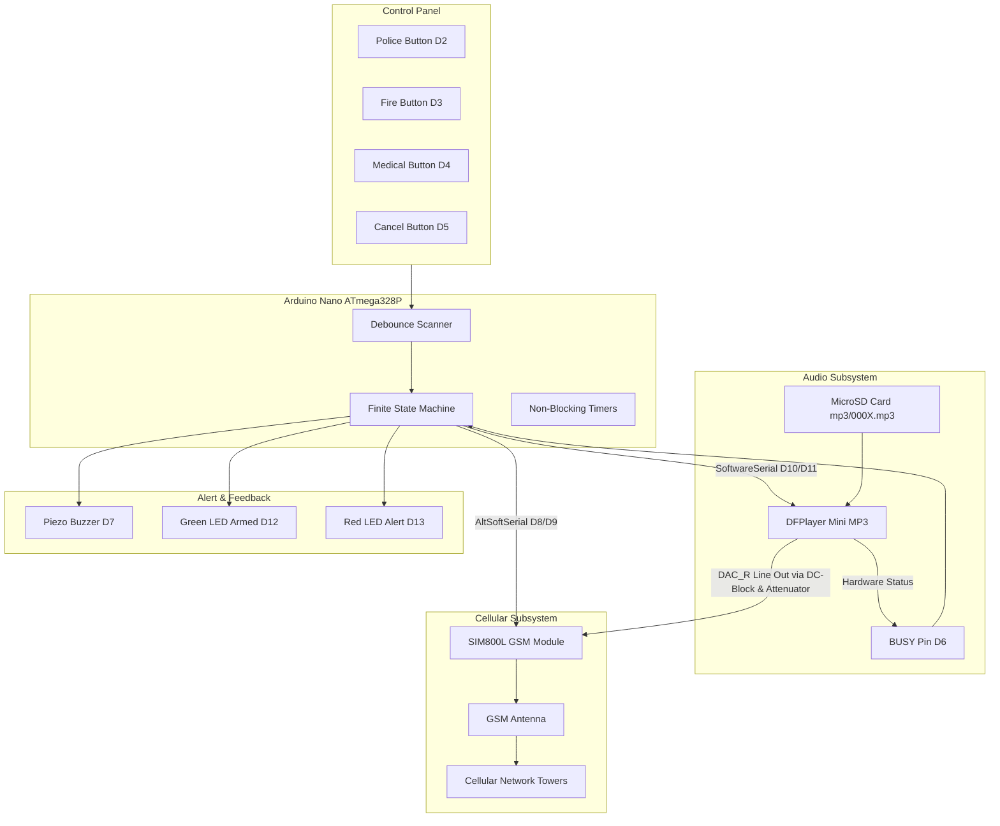

# 🚨 Home Emergency Distress System (HEDS)
### Standalone Single-Touch Cellular Voice & SMS Emergency Dispatcher

[](https://platformio.org/)
[-blue.svg)](https://www.arduino.cc/)
[](https://www.simcom.com/)
[](https://wiki.dfrobot.com/DFPlayer_Mini_SKU_DFR0299)
[](#-simulation-guides)

---

## 📌 Project Overview

The **Home Emergency Distress System (HEDS)** is a standalone, single-touch emergency communication device designed to bypass vulnerable analog landlines and local home Wi-Fi networks. 

Built on an embedded microcontroller architecture, the system continuously monitors an industrial/tactile control panel with designated emergency buttons (**Police**, **Fire**, **Medical**) and a dedicated **Cancel / Reset** button. 

When a distress button is triggered, the system:
1. Initiates a **5-second audible grace period** to allow cancellation in case of accidental triggering.
2. Dispatches a high-priority **backup SMS alert** containing the physical premises address and nature of distress to a designated emergency contact.
3. Places a cellular voice call to local dispatch via an onboard **SIM800L GSM module**.
4. Actively monitors call progress (`AT+CLCC`) and, the instant the dispatcher answers, automatically injects a pre-recorded high-clarity voice payload into the active call via a **DFPlayer Mini hardware MP3 decoder**.
5. Repeats the voice broadcast 3 times with 2-second pauses (monitoring the DFPlayer `BUSY` pin), detects remote hangup, and gracefully terminates the call.

The device operates on an independent **3.7V 18650 Lithium-Ion battery backup with TP4056 charging**, ensuring 100% operational readiness during structural fires, natural disasters, or total grid power outages.

---

## 🎬 Live Simulation Demonstration

Watch the complete emergency trigger, 5-second abort countdown, backup SMS generation, cellular call dialing, and automated audio injection sequence running in the simulation:

https://github.com/md-shadhin-mia/home-emergency-distress-system/raw/main/docs/emergency_call_simulation.mp4

<div align="center">
  <video src="https://github.com/md-shadhin-mia/home-emergency-distress-system/raw/main/docs/emergency_call_simulation.mp4" controls="controls" width="100%" style="max-width: 800px; border-radius: 8px;">
    Your browser does not support the video tag.
  </video>
  <p><em>▶️ <strong><a href="https://github.com/md-shadhin-mia/home-emergency-distress-system/raw/main/docs/emergency_call_simulation.mp4">Direct Link: Click here to play or download the full simulation video (MP4)</a></strong></em></p>
</div>

---

## 🚨 Problem Statement

During high-stress events, structural fires, acute medical emergencies, or home invasions:
- **Panic & Cognitive Impairment**: Elderly, injured, disabled, or panicked individuals frequently struggle to find a smartphone, unlock screens, dial the appropriate 3-digit emergency number, and coherently articulate their street address and apartment number to a 911 dispatcher.
- **Vulnerability of POTS & VoIP**: Traditional analog telephone lines (POTS) can be physically severed at the property line, and modern VoIP landlines depend entirely on mains electricity and home Wi-Fi/fiber routers that die immediately when mains power fails.
- **The Solution**: A robust, battery-backed, single-button cellular distress appliance permanently mounted on a wall or bedside that guarantees automated voice dispatch and SMS location delivery with zero human speech required.

---

## ⚙️ System Architecture



---

## 🛠️ Hardware Bill of Materials (BOM)

| Component | Specification / Model | Qty | Purpose |
|---|---|:---:|---|
| **Microcontroller** | Arduino Nano V3.0 (ATmega328P, 16MHz) | 1 | Master logic controller & state machine |
| **Cellular Module** | SIM800L GSM Module (Micro-SIM) | 1 | Quad-band 2G cellular voice dialing & SMS |
| **Audio Decoder** | DFPlayer Mini (YX5200 / GD3200 chipset) | 1 | Hardware MP3 decoding from MicroSD |
| **Memory** | MicroSD Card (FAT32, ≤ 32GB) | 1 | Stores distress audio tracks (`/mp3/0001.mp3`) |
| **Battery** | 18650 3.7V Lithium-Ion (2500-3000mAh) | 1 | Supplies 2A burst current for GSM transmission |
| **Battery Charger** | TP4056 Li-Ion Charger Module with Protection | 1 | Keeps 18650 charged via 5V USB mains |
| **Voltage Regulator** | MT3608 Boost or LM2596 Buck Converter | 1 | Provides regulated 5.0V to Arduino Nano & DFPlayer |
| **Emergency Buttons**| Momentary Push Buttons (Red, Orange, Blue, Grey)| 4 | Police, Fire, Medical, and Cancel triggers |
| **Audible Sounder** | 5V Piezo Buzzer | 1 | Countdown beeps, trigger chirps, error tones |
| **Status Indicators**| 5mm LEDs (1x Green, 1x Red) | 2 | Armed and Alert/Fault visual feedback |
| **Bulk Capacitor** | 1000µF 16V Low-ESR Electrolytic Capacitor | 1 | Buffers GSM 2A current spikes across SIM800L VCC/GND |
| **Decoupling Caps** | 0.1µF Ceramic Capacitors | 2 | Audio DC-blocking & high-frequency GSM decoupling |
| **Resistors** | 1kΩ (3x), 2kΩ (1x), 10kΩ (1x), 220Ω (2x) | 7 | Voltage dividers, audio attenuator, LED limits |

---

## 🔌 Hardware Pinout Map

| Arduino Nano Pin | Connected Device | Function | Circuit Details |
|---|---|---|---|
| **D0 (RX)** | USB Interface | Serial Monitor | USB debug output (9600 / 115200 baud) |
| **D1 (TX)** | USB Interface | Serial Monitor | USB debug output (9600 / 115200 baud) |
| **D2** | Police Button | Digital Input | Active LOW (`INPUT_PULLUP`), other pin to GND |
| **D3** | Fire Button | Digital Input | Active LOW (`INPUT_PULLUP`), other pin to GND |
| **D4** | Medical Button | Digital Input | Active LOW (`INPUT_PULLUP`), other pin to GND |
| **D5** | Cancel / Reset Button | Digital Input | Active LOW (`INPUT_PULLUP`), other pin to GND |
| **D6** | DFPlayer Mini `BUSY` | Digital Input | Active LOW hardware status (LOW = playing, HIGH = idle) |
| **D7** | Piezo Buzzer (+) | Digital Output | Generates audible countdown beeps and status tones |
| **D8** | SIM800L `TXD` | `AltSoftSerial` RX | Direct connection from SIM800L TX |
| **D9** | SIM800L `RXD` | `AltSoftSerial` TX | **1kΩ / 2kΩ Voltage Divider** (5V to 3.3V level shift) |
| **D10** | DFPlayer Mini `RX` | `SoftwareSerial` TX | Connected via **1kΩ series resistor** |
| **D11** | DFPlayer Mini `TX` | `SoftwareSerial` RX | Direct connection from DFPlayer TX |
| **D12** | Green Status LED | Digital Output | Armed & GSM Registered (via **220Ω resistor** to GND) |
| **D13** | Red Status LED | Digital Output | Emergency Active / Network Fault (via **220Ω resistor** to GND) |
| **A0 (D14)** | SIM800L `RST` | Digital Output | Hardware modem recovery reset pulse |

---

## 📐 Electrical Wiring & Schematics

### 1. SIM800L UART Level Shifting (5V ➔ 3.3V)
The SIM800L UART runs on 3.3V logic. Connecting the 5V Arduino Nano TX pin directly will damage the modem:

```
Arduino Nano D9 (TX) ────[ 1kΩ ]────┬────> SIM800L RXD
                                    │
                                  [ 2kΩ ]
                                    │
                                   GND
```

### 2. Audio Injection Circuit (DFPlayer ➔ SIM800L Mic)
Connecting the DFPlayer speaker output directly to the SIM800L microphone input causes severe clipping and garbled audio. We tap the line-level `DAC_R` pin, block the DC bias with a `0.1µF` capacitor, and attenuate the signal 10:1 (–20 dB) using a passive divider:

```
DFPlayer Mini                       SIM800L GSM Module
┌──────────────┐                     ┌─────────────────┐
│              │     0.1µF      10kΩ │                 │
│        DAC_R ├─────┤├───┬───[====]─┤ MICP            │
│              │   Ceramic│          │                 │
│              │          │          │                 │
│              │        [===] 1kΩ    │                 │
│              │          │          │                 │
│          GND ├──────────┴──────────┤ MICN / GND      │
└──────────────┘                     └─────────────────┘
```

### 3. Power Subsystem Architecture
```
 Mains 5V USB (Charger)
          │
          ▼
   ┌──────────────┐
   │    TP4056    ├───[+]───┐
   │   Charger    ├───[-]─┐ │
   └──────────────┘       │ │
                          │ │
                   ┌──────┴─┴──────────┐
                   │ 18650 3.7V Li-Ion │
                   └──────┬─┬──────────┘
                          │ │
           ┌──────────────┘ └──────────────┐
           ▼                               ▼
    To SIM800L VCC & GND        ┌────────────────────┐
  (Via 1000µF Bulk Cap)         │ MT3608 Boost Conv. │
                                │ (Step up to 5.0V)  │
                                └─────────┬──────────┘
                                          │
                                          ▼
                                 To Arduino Nano 5V pin
                                  & DFPlayer Mini VCC
```

> [!IMPORTANT]
> **Common Ground**: All grounds (Arduino Nano GND, SIM800L GND, DFPlayer GND, and 18650 Battery Negative) **must be securely bonded to a common ground rail**.

---

## 📂 MicroSD Card Setup

Format the MicroSD card as **FAT32** (allocation unit size: default). Create a folder named **`mp3`** in the root directory and place your pre-recorded distress files:

```
/ (MicroSD Root)
└── mp3/
    ├── 0001.mp3   <-- Police Emergency Voice Payload
    ├── 0002.mp3   <-- Fire Emergency Voice Payload
    └── 0003.mp3   <-- Medical Emergency Voice Payload
```

#### Voice Message Template (`0001.mp3`):
> *"Emergency dispatch. This is an automated distress call from 123 Main Street, Apartment 4B. A police emergency is in progress at this location. Immediate police assistance is requested. This message will repeat."*

---

## 🔄 Finite State Machine (FSM) Lifecycle

The firmware utilizes a fully non-blocking state machine in [src/main.cpp](src/main.cpp):

```mermaid
stateDiagram-v2
    [*] --> STATE_INIT
    STATE_INIT --> STATE_IDLE: GSM Registered & DFPlayer Ready
    STATE_INIT --> STATE_FAULT: SIM/Network Timeout (Retries in background)
    STATE_FAULT --> STATE_IDLE: Network Restored

    STATE_IDLE --> STATE_COUNTDOWN: Button Pressed (Police/Fire/Medical)
    STATE_COUNTDOWN --> STATE_IDLE: Cancel Button Pressed (Within 5 seconds)
    STATE_COUNTDOWN --> STATE_SEND_SMS: 5-Second Timer Expires

    STATE_SEND_SMS --> STATE_DIAL_CALL: SMS Dispatched to Backup Contact
    STATE_DIAL_CALL --> STATE_CALL_WAIT_ANSWER: Dial Command Sent (ATD;)

    STATE_CALL_WAIT_ANSWER --> STATE_PLAY_AUDIO: Call Answered (AT+CLCC stat=0)
    STATE_CALL_WAIT_ANSWER --> STATE_CALL_RETRY: Busy / No Carrier / 45s Ring Timeout
    STATE_CALL_WAIT_ANSWER --> STATE_IDLE: Cancel Pressed (Hangs Up)

    STATE_PLAY_AUDIO --> STATE_PLAY_AUDIO: Track Finished (Repeats < 3 times, 2s pause)
    STATE_PLAY_AUDIO --> STATE_IDLE: 3 Repeats Finished / Remote Hangup / Cancel Pressed

    STATE_CALL_RETRY --> STATE_DIAL_CALL: Retries < 3 (Wait 3s)
    STATE_CALL_RETRY --> STATE_IDLE: Retries Exhausted (Alert tone sounded)
```



---

## 🧪 Simulation Guides

The project includes pre-configured simulation assets for both **Proteus Professional** and **Wokwi**.

### 1. Proteus Professional (ISIS)
Pre-compiled binaries and step-by-step schematics are located in the [`proteus/`](proteus/) directory:
- **`proteus/firmware_simulation.hex`**: Pre-compiled simulation binary (auto-simulates GSM registration, SMS generation, dispatcher call answering, and MP3 busy-timing).
- **`proteus/PROTEUS_GUIDE.md`**: Complete ISIS device library keywords, Virtual Terminal configuration, and schematic instructions.

#### Quick Steps:
1. Place an **Arduino Nano** (or ATmega328P @ 16MHz) in ISIS.
2. Wire buttons to D2, D3, D4, D5 (connecting to GND).
3. Connect a **Virtual Terminal** at **9600 baud** (Nano TX D1 ➔ Terminal RXD, Nano RX D0 ➔ Terminal TXD).
4. Double-click the Nano, load `proteus/firmware_simulation.hex` into **Program File**, and press **Play**.

### 2. Wokwi Simulator
The project contains [`wokwi.toml`](wokwi.toml) and [`diagram.json`](diagram.json):
- In **VS Code**: Install the Wokwi extension, compile (`pio run -e nano_simulation`), open `diagram.json`, and click **Play**.
- In **Browser**: Copy `diagram.json` into [wokwi.com/arduino/new](https://wokwi.com/arduino/new).

---

## 🚀 Configuration & Calibration

All emergency phone numbers, premises text, and tuning constants are centralized in [`include/config.h`](include/config.h):

```c
// Emergency Contacts
#define POLICE_PHONE_NUMBER     "911"
#define FIRE_PHONE_NUMBER       "911"
#define MEDICAL_PHONE_NUMBER    "911"
#define BACKUP_SMS_NUMBER       "+10000000000"

// Physical Premises Address for SMS
#define PREMISES_ADDRESS        "123 Main St, Apt 4B, Springfield"

// Operational Constants
#define COUNTDOWN_DURATION_MS   5000UL  // 5-second abort grace window
#define AUDIO_REPEAT_COUNT      3       // Repeat voice message 3 times
#define AUDIO_PAUSE_MS          2000UL  // 2-second pause between repeats
#define MAX_DIAL_RETRIES        3       // Retry up to 3 times if busy/unanswered
#define DFPLAYER_VOLUME         20      // Volume level (0 - 30)
#define SIM800L_MIC_GAIN        6       // Mic gain (0 - 15) via AT+CMIC=0,x
```

---

## 🔨 Building & Flashing (PlatformIO)

### Flash to Physical Hardware:
```bash
# Build and upload to Arduino Nano
pio run -e nanoatmega328new -t upload

# Open Serial Monitor at 9600 baud
pio device monitor -b 9600
```

### Build for Simulation:
```bash
# Compiles simulation firmware with virtual cellular & audio engine
pio run -e nano_simulation
```

---

## 📜 License
This project is open-source under the **MIT License**. Free for personal, academic, and non-commercial community safety use.
